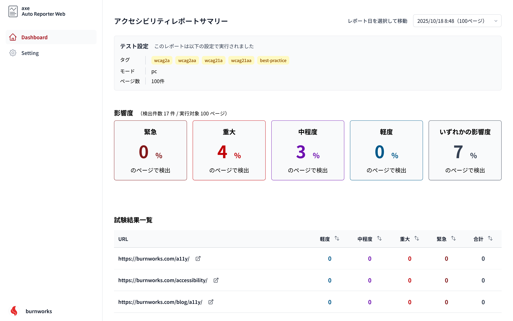
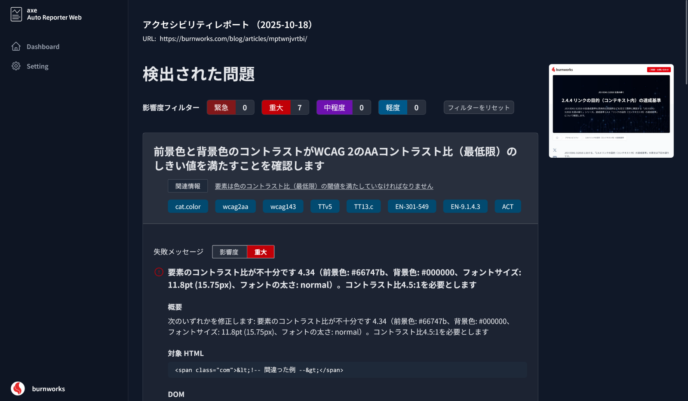
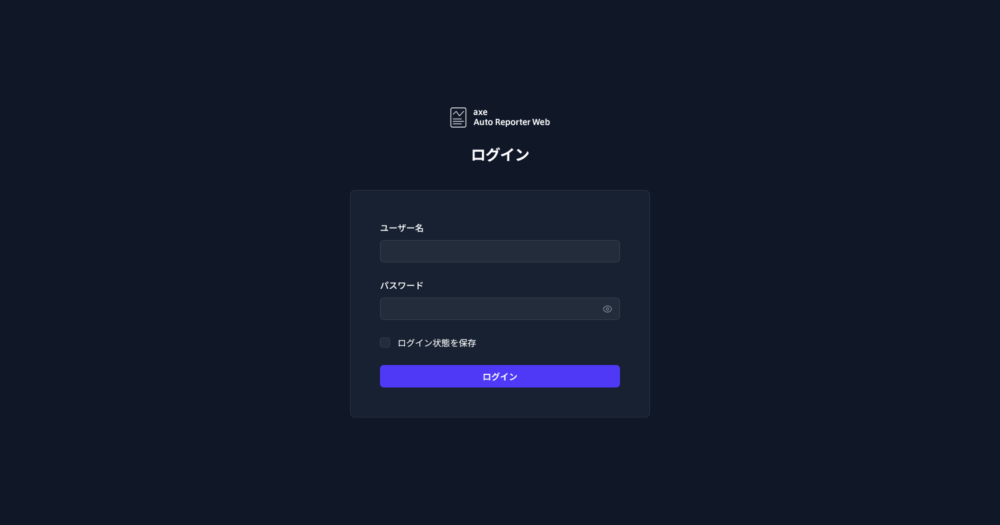

# axe Auto Reporter Web

This dashboard application uses [@axe-core/puppeteer](https://github.com/dequelabs/axe-core-npm/blob/develop/packages/puppeteer/README.md) to automatically run accessibility tests against the URLs listed in a specified `sitemap.xml`, then presents the results as reports.






## Requirements
- Node.js 22.x or later
- npm 10.x or later

> [!TIP]
> When running on Linux, Puppeteer may fail because the Chromium-related libraries it depends on are missing. Install them beforehand as needed.

## Installation
Clone the repository, move into it, and install the dependencies.

```sh
git clone https://github.com/burnworks/axe-auto-reporter-web.git
cd axe-auto-reporter-web
npm install
```

## Initial Setup

### 1. First launch
Run the commands below and open `http://localhost:3000` in your browser.

```sh
npm run build
npm run preview -- --host 0.0.0.0 --port 3000
```

On the first launch the app creates the required files under `data/`.

### 2. Configure settings
Open the Settings screen, enter the sitemap URL and other required options, and save. The values are written to `data/settings.json` and `data/url-list.txt`.

### 3. Run a test
Run the command below in another terminal to execute a one-off crawl with the saved settings (the script streams logs to the console, so wait until it finishes).

```sh
node script/scheduler.mjs --once
```

### 4. Review the results
Return to the browser, refresh the page, and confirm that the accessibility report cards are displayed on the dashboard.


### 5. Configure the scheduler
Once a report has been generated you have two options:

```sh
node script/scheduler.mjs
```

Run the command above in another terminal to keep the scheduler active so it follows the frequency specified on the Settings screen.

```sh
node script/scheduler.mjs --once
```

Alternatively, schedule the command above (without `--once`) via Windows Task Scheduler, macOS launchd, or another scheduling tool that best fits your environment. In that case the in-app “test frequency” setting is ignored, so configure the interval on the OS side instead.

If setting up a scheduler is cumbersome, simply run `node script/scheduler.mjs --once` manually whenever you need a fresh report.

Before every run the scheduler reloads `data/settings.json`, retrieves the sitemap URL, tags, crawl mode, maximum pages, and frequency (`daily`, `weekly`, or `monthly`), generates reports under `src/pages/results/`, and updates the index stored in `data/reports/index.json`.

## Tips
When running on a Linux server with Node.js installed, keep the following two processes alive with PM2 (or a similar process manager). You still need to configure your web server separately.

```sh
# Install
git clone https://github.com/burnworks/axe-auto-reporter-web.git
cd axe-auto-reporter-web
cp .env.sample .env  # Edit this file with your own credentials
npm install
npm run build

# Install PM2
npm install -g pm2

# Start the dashboard
pm2 start dist/server/entry.mjs --name axe-dashboard --interpreter node

# Start the scheduler
pm2 start script/scheduler.mjs --name axe-scheduler --interpreter node

# Optional: configure PM2 to restart on boot
pm2 startup
pm2 save
```

### Deploying to Vercel (or similar)
I haven’t actually tried this flow, but the deployment would likely look like this:

1. Update `.gitignore` and run `git add` so that `src/pages/results/*`, `public/results/`, and `data/` are tracked.
2. Follow the “Initial Setup” steps once on your local machine: start the dashboard, complete the initial settings, and run `node script/scheduler.mjs --once` to generate the first report.
3. Push the changes to GitHub and deploy the repository to Vercel (set up the domain and other basics).
4. Configure the `.env` values as Environment Variables on Vercel.
5. Visit the dashboard and confirm that the report is visible.
6. Configure GitHub Actions to run `node script/scheduler.mjs --once` on your schedule and push to the target branch (if `USER_AUTHENTICATION=true`, store the `.env` values in GitHub Secrets).
7. Trigger Vercel deployments from pushes to the designated branch.

## User Authentication (Optional)
Follow the steps below if you want to enable user authentication.

Rename `.env.sample` to `.env`.

Set `USER_AUTHENTICATION=true` (the default value) in the newly created `.env` file to turn the feature on. Once enabled, dashboard access requires signing in.

Check “Keep me signed in” on the login form to store a session for 30 days. If `.env` is missing, the application treats `USER_AUTHENTICATION` as `false` and behaves exactly like previous versions, so you can still evaluate it locally without setting up authentication.

> [!IMPORTANT]
> Sessions are issued as cookies with the `Secure` attribute, assuming the application is running over HTTPS. When deploying to a public server, make sure the site is served via HTTPS to prevent the cookies from being rejected.

### Environment variables required for authentication

`.env.sample` includes the following sample values. Replace them with your own secure credentials before deploying.

```env
USER_AUTHENTICATION=true
ADMIN_USERNAME=please-change-your-username
ADMIN_PASSWORD=please-change-your-password
AUTH_SESSION_SECRET=please-change-this-secret-value
```

- `USER_AUTHENTICATION`: Set to `true` to enable authentication. Use `false` to keep the application accessible without signing in (helpful in closed environments during evaluation).
- `ADMIN_USERNAME`: Username for the administrator account.
- `ADMIN_PASSWORD`: Password for the administrator account. Choose a strong, hard-to-guess value.
- `AUTH_SESSION_SECRET`: Secret key used to sign session cookies. Provide a random string with at least 32 characters.

Ensure the `.env` file is excluded from version control after editing the values.



## Known Limitations (as of v1.1.x)

- User authentication remains optional. If you disable it, continue to operate the app in a closed environment and restrict access on the server side.
- Only URLs that start with `http://` or `https://` are processed. Non-HTML resources (such as PDFs) may open in the browser viewer, but no meaningful accessibility results will be produced.
- The dashboard does not raise alerts when a crawl fails. If a report is missing or incomplete, inspect the execution logs from `script/axe-auto-reporter.mjs`.

## Future Plans

- ~~Add user authentication so the app can run safely on public servers~~ – delivered in v1.1.0 (disabled by default)
- Store reports, settings, and other data in an RDB once authentication is introduced
- Provide an easier Docker-based setup

## Related Scripts

- [burnworks/axe-auto-reporter](https://github.com/burnworks/axe-auto-reporter)
