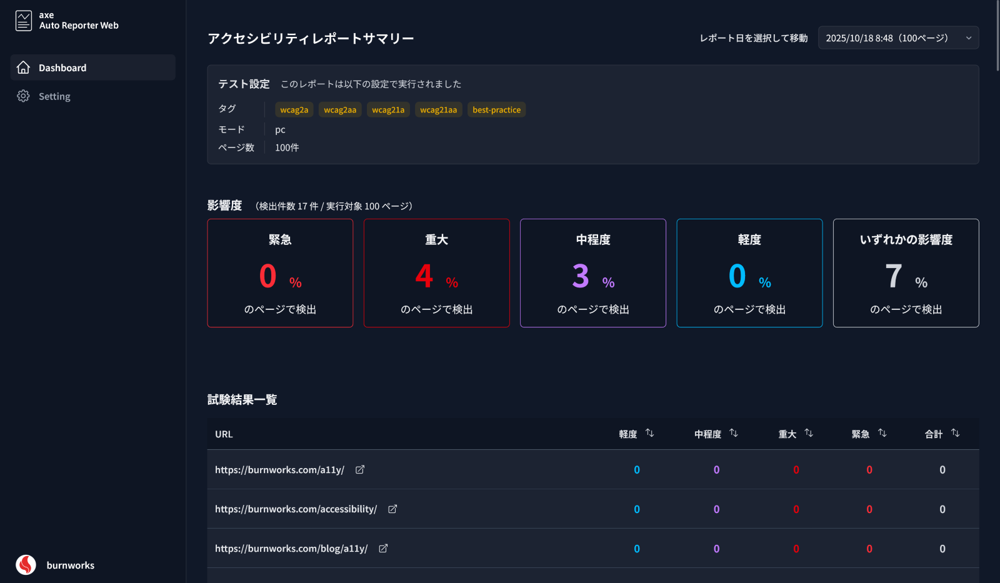

# axe Auto Reporter Web

This dashboard application uses [@axe-core/puppeteer](https://github.com/dequelabs/axe-core-npm/blob/develop/packages/puppeteer/README.md) to automatically run accessibility tests for the URLs listed in a supplied `sitemap.xml`, then presents the results as reports.





## Prerequisites
- Node.js 20.x or later
- npm 10.x or later

> [!TIP]
> When you run the app on Linux without Docker, Puppeteer may fail if Chromium shared libraries are missing. Consult the project `Dockerfile` for the required packages and install them in advance.

## Installation
From the repository root, run:

```sh
npm install
```

## First Launch and Initial Setup

### 1. First Launch
Execute the commands below in a terminal, then open `http://localhost:3000` in your browser.  

```sh
npm run build
npm run preview -- --host 0.0.0.0 --port 3000
```

The initial launch creates the necessary seed files under `data/`.

### 2. Setting
Open the Settings screen, enter the sitemap URL and other required fields, then save. The values are written to `data/settings.json` and `data/url-list.txt`.

### 3. Run test
In another terminal, run `node script/scheduler.mjs --once` to execute the accessibility pipeline with the saved settings (progress appears in the terminal; wait until it finishes).

### 4. Start
Return to the browser and refresh the page to make sure the initial report cards are rendered on the dashboard.

After the first report has been generated, you can keep `node script/scheduler.mjs` running (without `--once`) so the cron schedule defined in the script continues producing future reports automatically.

Before each execution the scheduler loads `data/settings.json`, gathering the sitemap URL, tags, crawl mode, maximum page count, and frequency (`daily`, `weekly`, or `monthly`). Generated reports are stored under `src/pages/results/` and indexed in `data/reports/index.json`.

## Using Docker
The provided `Dockerfile` installs Puppeteer dependencies, builds the dashboard, and launches both the web server and the scheduler.

### Build and Run
Run the following to build the image and start a container:

```sh
docker build -t axe-auto-reporter-web .
docker run --rm -p 3000:3000 axe-auto-reporter-web
```

Stopping this container resets the configuration and generated reports.

#### Persisting Data
If you want settings and reports to survive container restarts, mount the `data/` directory from the host:

```sh
docker run --rm -p 3000:3000 -v "$(pwd)/data:/app/data" axe-auto-reporter-web
```

### Initial Configuration
After the container starts, open `http://localhost:3000`, navigate to Settings, and save the required fields such as the sitemap URL.

### Scheduler
Inside the container, `docker-start.sh` keeps `script/scheduler.mjs` running so scheduled accessibility tests continue to fire. The cadence follows the frequency chosen in the Settings screen, with the default cron triggering at 03:00 (Asia/Tokyo).

Once the initial setup is done you can simply leave the container running and wait for the scheduled job to create the first report automatically.

If you need an immediate report, run:

```sh
docker exec -it <container-name-or-id> node script/scheduler.mjs --once
```

Replace `<container-name-or-id>` with the value shown by `docker ps`.

## Notes (as of v1.0.0)

- This application is intended to run on a user's local machine or within a closed server environment. Authentication and authorization features are not built in, so do not deploy it on a publicly accessible server.
- Only URLs that start with `http://` or `https://` are tested. Non-HTML content such as PDFs may open in the browser's viewer, but accessibility scans will not produce meaningful results.
- The dashboard does not surface failures or other alerts. If reports are missing or incomplete, inspect the output logs from `script/axe-auto-reporter.mjs`.

## Related Scripts

- [burnworks/axe-auto-reporter](https://github.com/burnworks/axe-auto-reporter)
