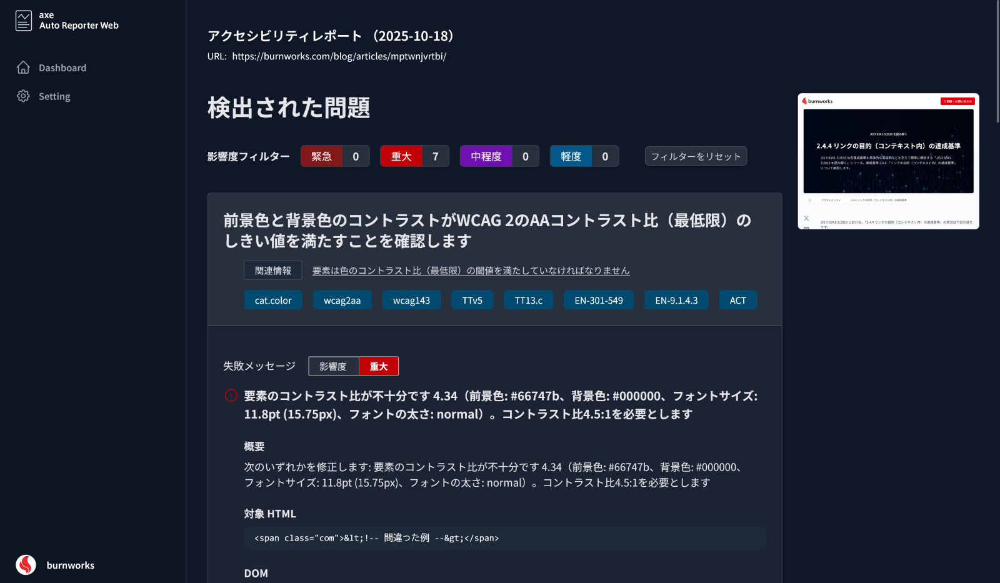

# axe Auto Reporter Web

[@axe-core/puppeteer](https://github.com/dequelabs/axe-core-npm/blob/develop/packages/puppeteer/README.md) を使用して、指定した `sitemap.xml` 内の URL に対してアクセシビリティテストを自動的に実行、その結果をレポートとして表示するダッシュボードアプリです。




## 必要条件
- Node.js 22.x 以降
- npm 10.x 以降

> [!TIP]
> Linux 環境で実行する場合、Puppeteer が要求する Chromium 系ライブラリが不足してエラーになることがあります。必要に応じて事前にインストールしておいてください。

## インストール
リポジトリを `clone` した後、ルートディレクトリに移動して `npm install` を実行します。

```sh
git clone https://github.com/burnworks/axe-auto-reporter-web.git
cd axe-auto-reporter-web
npm install
```

## 起動と初期設定

### 1. 初回起動
ターミナルで以下のコマンドを実行し、ブラウザで `http://localhost:3000` を開きます。  

```sh
npm run build
npm run preview -- --host 0.0.0.0 --port 3000
```

初回起動時に `data/` ディレクトリが作成され、必要な初期ファイルが作成されます。

### 2. 初期設定
設定画面（Setting）を開いてサイトマップの URL など必要な項目を入力して保存します。（設定を保存すると `data/settings.json` と `data/url-list.txt` が更新されます）

### 3. 初回テストの実行
別のターミナルで以下のコマンドを実行し、初回アクセシビリティテストを実行します（CUI 画面に進捗が表示されますのでテストが終わるまでお待ちください）。

```sh
node script/scheduler.mjs --once
```

### 4. 運用開始
初回テストが完了したらブラウザ画面に戻って再読み込みし、アクセシビリティレポートがダッシュボードに表示されているかを確認します。


### 5. テストスケジュールの設定
初回レポートが生成された後は、以下のように `node script/scheduler.mjs` を（`--once` なしで）別のターミナルで実行し、常駐させておくと、設定画面で選択した「テスト頻度」設定に従って以降のレポートが自動で作成されます。

```sh
node script/scheduler.mjs
```

あるいは、Windows のタスクスケジューラ、Mac の launchd などで、以下のコマンドを任意の間隔で自動実行することで代用もできます（この場合、設定画面の「テスト頻度」設定は使用されません）。

```sh
node script/scheduler.mjs --once
```

もし、スケジュール設定が難しい場合は、任意のタイミングで `node script/scheduler.mjs --once` を実行しても構いません。

スケジューラは毎回実行前に `data/settings.json` を読み込み、sitemap.xml の URL、タグ、クロールモード、対象ページ数（上限）、テスト頻度（`daily` / `weekly` / `monthly`）を参照します。生成されたレポートは `src/pages/results/` に保存され、`data/reports/index.json` にインデックスされます。

## ヒント
Node.js が導入済みの Linux サーバで稼働させる場合、PM2 等を使用して、以下の2つのプロセスを常駐させてください（別途、ウェブサーバ等の設定は必要です）。

```sh
# インストール
git clone https://github.com/burnworks/axe-auto-reporter-web.git
cd axe-auto-reporter-web
cp .env.sample .env  # 認証情報を設定
npm install
npm run build

# PM2 の導入
npm install -g pm2

# ダッシュボード本体の立ち上げ 
pm2 start dist/server/entry.mjs --name axe-dashboard --interpreter node

# スケジューラの立ち上げ 
pm2 start script/scheduler.mjs --name axe-scheduler --interpreter node

# 任意で PM2 の自動起動設定など
pm2 startup
pm2 save
```

### Vercel 等にデプロイするなら
実際に試していないので正確なことは言えませんが、恐らく以下のような手順でデプロイできるのではないかと思います。

1. `.gitignore` を編集、`git add` するなどして、`src/pages/results/*`, `public/results/`, `data/` を追跡対象に
2. 「起動と初期設定」セクションに従い一度ローカル環境でダッシュボードを立ち上げ、初期設定を行い、`node script/scheduler.mjs --once` を実行して初回レポートを作成
3. GitHub に push し、リポジトリの内容を Vercel にデプロイ（ドメインの設定含め基本設定を行う）
4. `.env` の内容を環境変数（Environment Variables）に設定
5. ダッシュボードにアクセスしてレポートが表示されることを確認
6. GitHub Actions で任意のタイミングで `node script/scheduler.mjs --once` を実行し、指定のブランチに `push` するように設定（`USER_AUTHENTICATION=true` の場合は、GitHub Secrets に `.env` の内容を設定）
7. 指定ブランチへの `push` をトリガーに Vercel にデプロイ

## ユーザー認証（オプション）
以下の設定を行うと、ユーザー認証機能を有効にできます。

`.env.sample` を `.env` にリネームしてください。

作成した `.env` で `USER_AUTHENTICATION=true` （初期値）に設定すると、ユーザー認証機能が有効になり、ダッシュボードへのアクセスにはログインが必要になります。

未ログイン状態でダッシュボードにアクセスすると、ログインページにリダイレクトされますので、.env に設定したユーザー名とパスワードでログインしてください。ログイン画面の「ログイン状態を保存」にチェックを付けると 30 日間のセッションが発行されます。

なお、`.env` を作らない場合は `USER_AUTHENTICATION=false` として扱われます。

> [!IMPORTANT]
> 発行されるクッキーは HTTPS を前提に Secure 属性付きで保存されます。公開サーバーで運用する際は、必ず HTTPS で接続可能な環境で稼働させてください。

### ユーザー認証有効時に必要な環境変数

`.env.sample` は以下の通りです。ユーザー認証機能を有効にする場合は、必ず以下の環境変数を事前に設定してください。

```env
USER_AUTHENTICATION=true
ADMIN_USERNAME=please-change-your-username
ADMIN_PASSWORD=please-change-your-password
AUTH_SESSION_SECRET=please-change-this-secret-value
```

- `USER_AUTHENTICATION`： `true` でユーザー認証を有効化、`false` にすると認証なしで利用できます（`false` の状態で第三者がアクセス可能な公開サーバで運用しないように注意してください）。
- `ADMIN_USERNAME`： ログインに使用するユーザー名を設定します。
- `ADMIN_PASSWORD`： ログインに使用するパスワードを設定します。推測されにくい強固なパスワードを指定してください。
- `AUTH_SESSION_SECRET`： セッションを署名するための秘密鍵です。32 文字以上のランダムな文字列を設定してください。

なお、設定済みの `.env` をリポジトリに含めたりしないようにしてください。

## 注意点（v1.1.x 時点）

- ユーザー認証機能が無効の状態で、第三者がアクセスする公開サーバで実行するような利用方法はしないでください。
- テストの対象は `http://` または `https://` で始まる URL のみです。PDF など非 HTML コンテンツはブラウザ内ビューアでアクセスできてしまいますが、アクセシビリティ試験自体は正常に実行されません。
- テストの失敗などに対するダッシュボード上での通知・表示などは行われません。レポートが正常に生成されない場合などは `script/axe-auto-reporter.mjs` の実行ログを確認してください。

## 今後の予定（時期未定）

- ~~ユーザー認証機能を追加して公開サーバでも運用できるようにしたい~~ → v1.1.0 でユーザー認証機能を実装（デフォルトは無効）
- 現状、設定データなど保存に RDB を使用していないが、ユーザー認証機能追加時に各データを RDB に保存するようにしたい
- Docker で簡単に立ち上げられるようにしたい

## 関連スクリプト

- [burnworks/axe-auto-reporter](https://github.com/burnworks/axe-auto-reporter)


